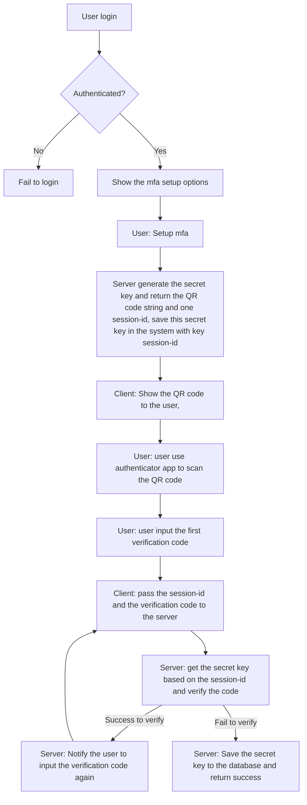
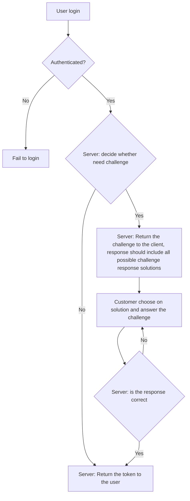

# Mfa Flow

```mermaid
flowchart TD
    A[User login] --> B{Authenticated?}
    B -- No --> Z[Fail to login]
    B -- Yes --> C[Show the mfa setup options]
    C --> D[User: Setup mfa]
    D --> E[Server generate the secret key and return the QR code string and one session-id, save this secret key in the system with key session-id]
    E --> F[Client: Show the QR code to the user,]
    F --> G[User: user use authenticator app to scan the QR code]
    G --> H[User: user input the first verification code]
    H --> I[Client: pass the session-id and the verification code to the server]
    I --> J[Server: get the secret key based on the session-id and verify the code]
    J -- Success to verify --> K[Server: Notify the user to input the verification code again]
    J -- Fail to verify --> L[Server: Save the secret key to the database and return success]
    K --> I
```

# Mfa Challenge Flow

```mermaid
flowchart TD
    A[User login] --> B{Authenticated?}
    B -- No --> Z[Fail to login]
    B -- Yes --> C{Server: decide whether need challenge}
    C -- Yes --> D[Server: Return the challenge to the client, response should include all possible challenge response solutions]
    C -- No --> Y[Server: Return the token to the user]
    D --> E[Customer choose on solution and answer the challenge]
    E --> F{Server: is the response correct}
    F -- No --> E
    F -- Yes --> Y

```