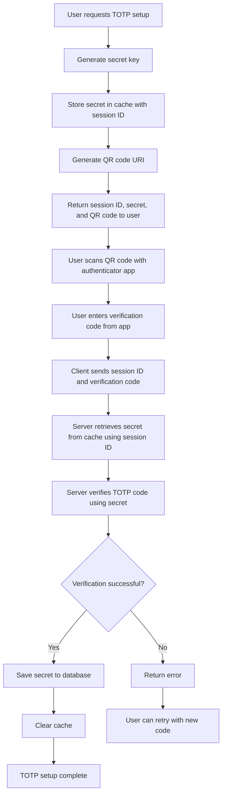
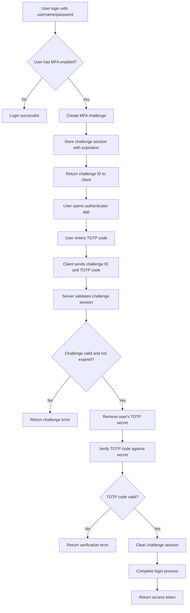
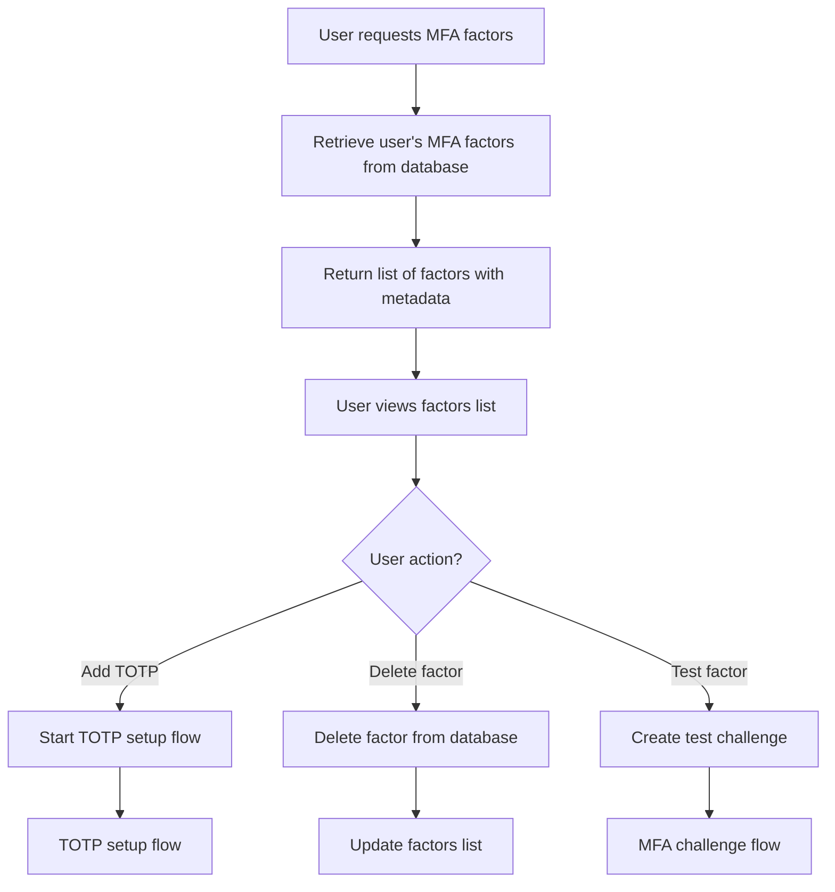
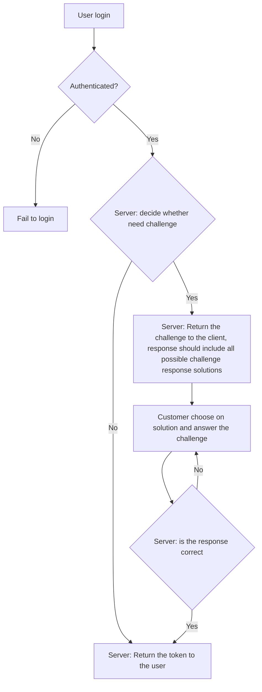

# MFA Flow

## TOTP Setup Flow

## MFA Challenge Flow

## MFA Factor Management Flow

## Security Considerations

### Time Window Tolerance

- TOTP codes are valid for ±1 time window (30 seconds each)
- Prevents clock drift issues between server and client

### Challenge Session Management

- Challenge sessions expire after 5 minutes
- Prevents replay attacks and session hijacking

### Secret Key Security

- Secrets generated using SecureRandom
- Temporary secrets stored in cache with expiration
- Persistent secrets encrypted in database

### Rate Limiting (Recommended)

- Limit TOTP verification attempts
- Implement account lockout after failed attempts
- Add delays between verification attempts

# Mfa Challenge Flow

